<div align="center">

# storage-io

**One console for all your S3-compatible storage.**

Self-hosted web console for MinIO, SeaweedFS, AWS S3, Ceph RGW, Garage, Cloudflare R2, Wasabi and any other S3 endpoint. Connect as many servers as you like, then manage buckets, objects, quotas, S3 users, policies, access keys and bulk jobs from a single place.

[](https://github.com/navid-kianfar/storage-io/actions/workflows/ci.yml)
[](https://github.com/navid-kianfar/storage-io/releases)
[](https://hub.docker.com/r/kianfar/storage-io)
[](LICENSE)

</div>

<p align="center">
  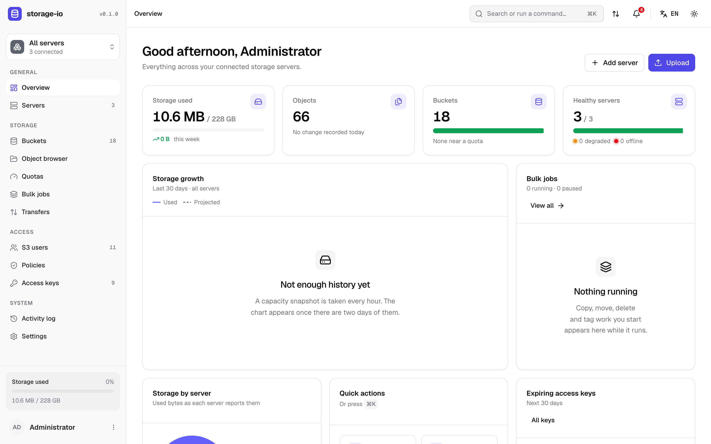
</p>

<table>
  <tr>
    <td>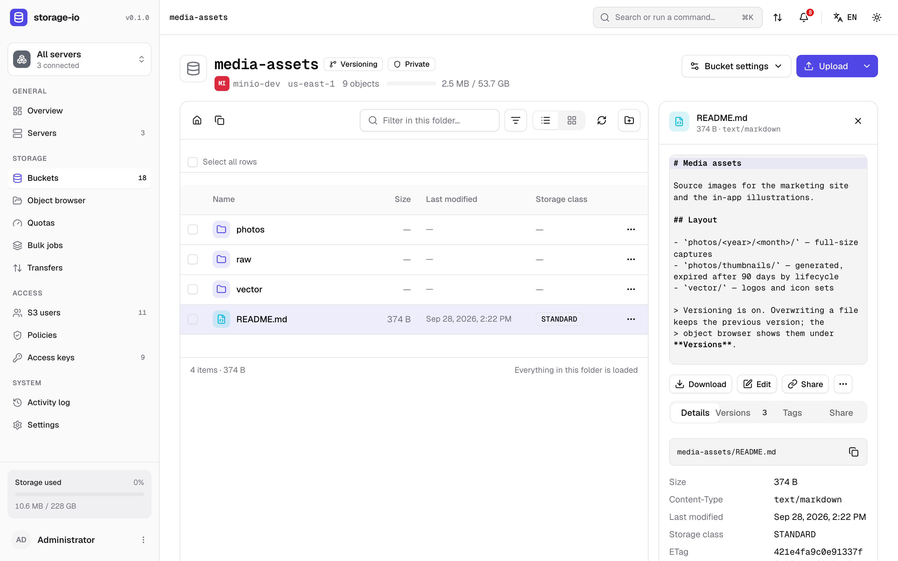</td>
    <td>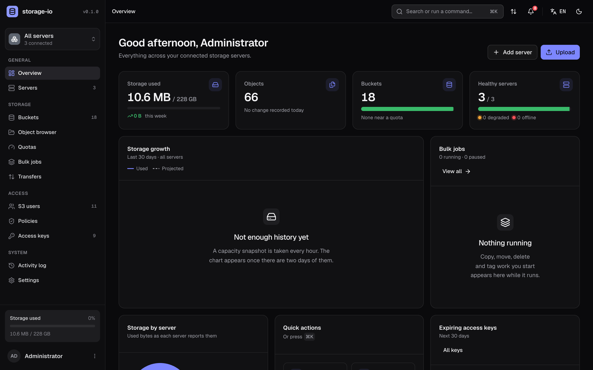</td>
  </tr>
  <tr>
    <td>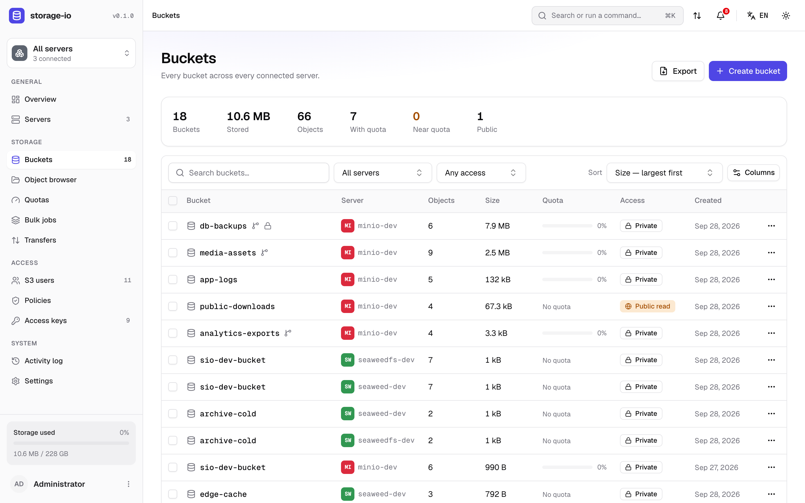</td>
    <td>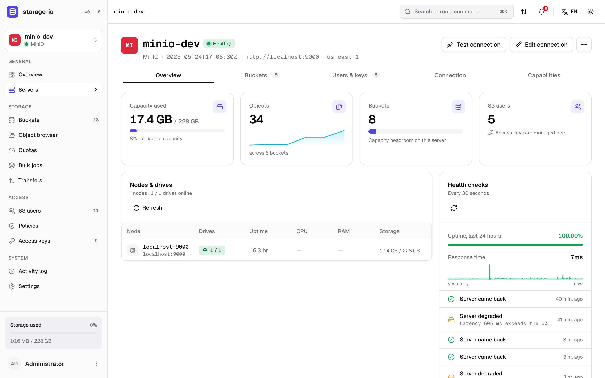</td>
  </tr>
  <tr>
    <td>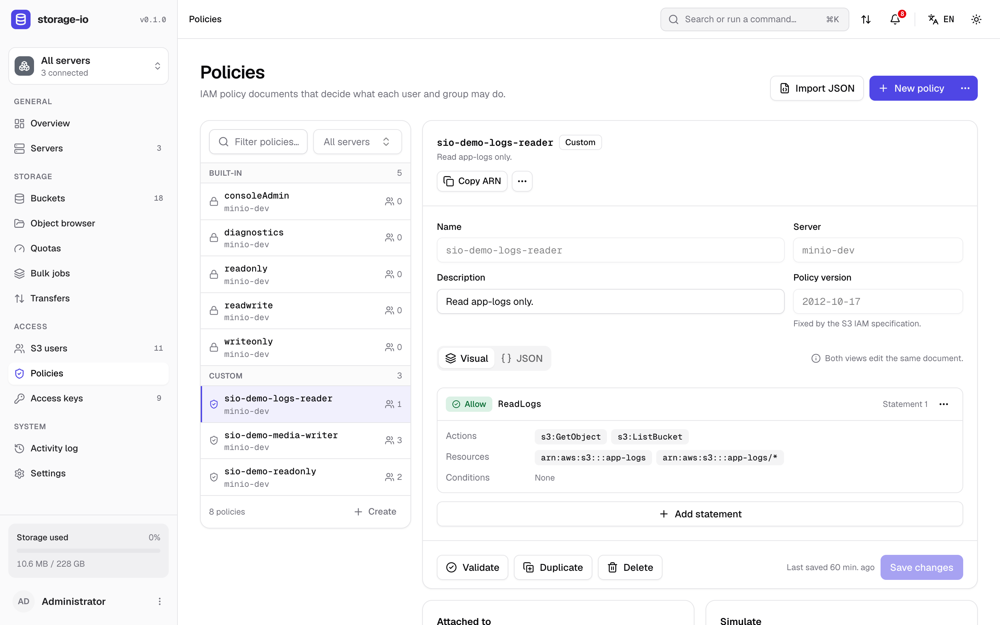</td>
    <td>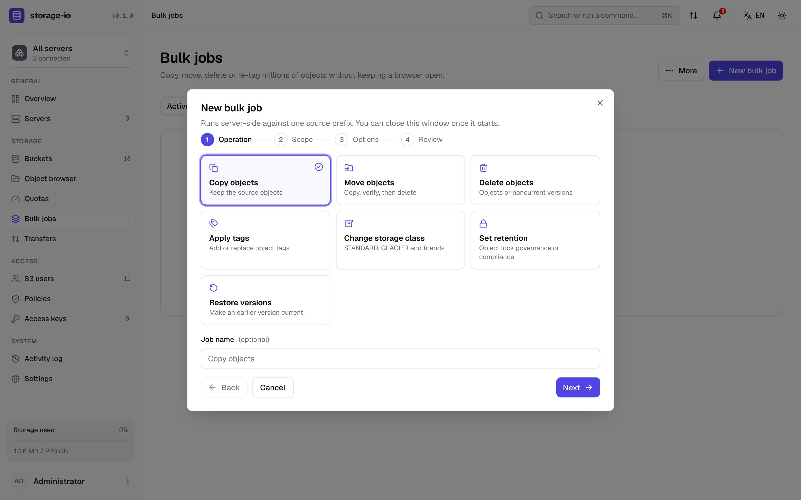</td>
  </tr>
  <tr>
    <td>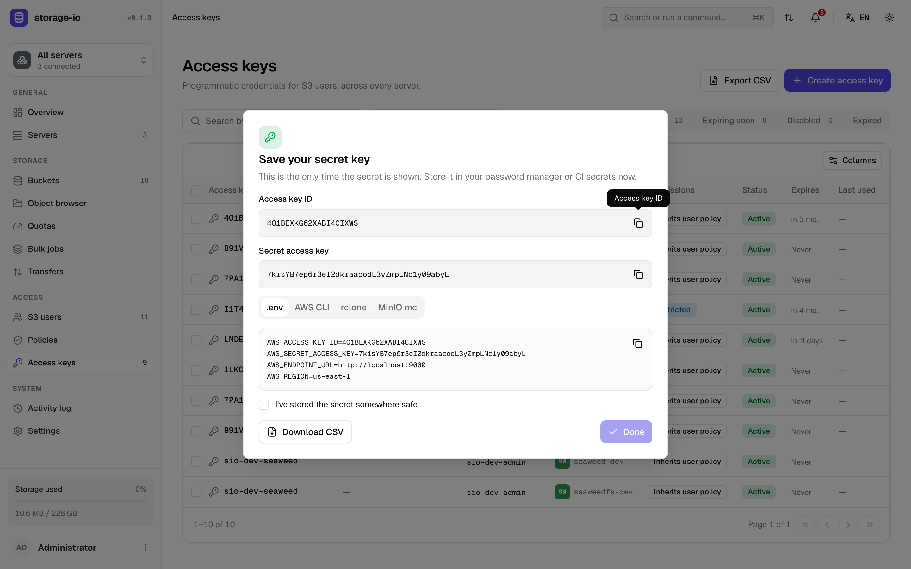</td>
    <td>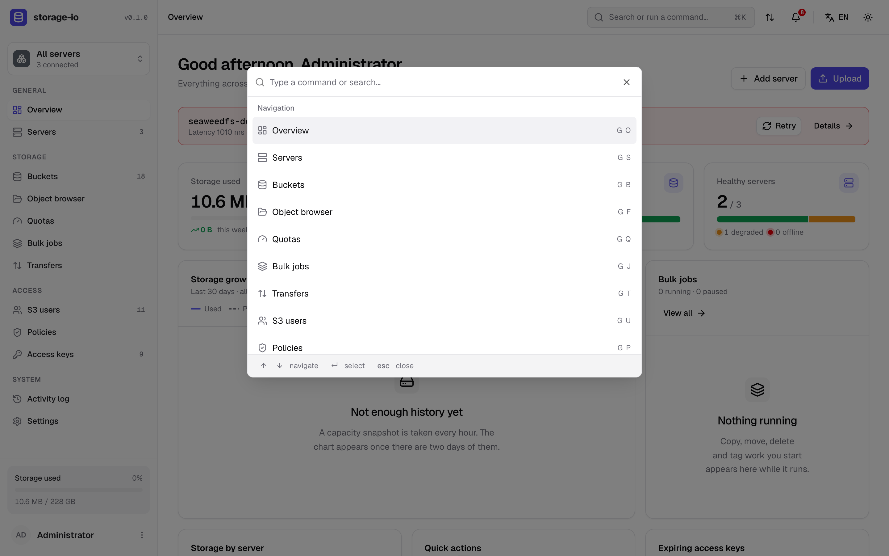</td>
  </tr>
</table>

<p align="center">
  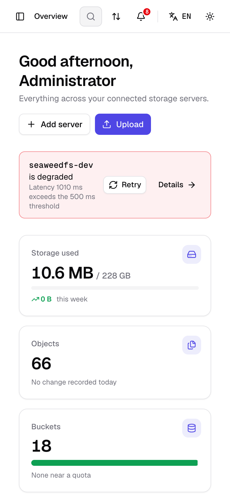
  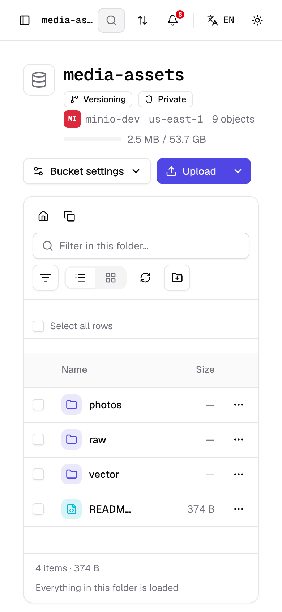
  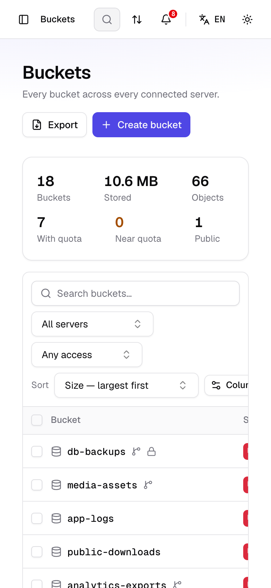
</p>

<p align="center"><sub>More in <a href="docs/screenshots">docs/screenshots</a>: every page in light, dark, RTL and mobile. Regenerate with <code>pnpm screenshots</code>.</sub></p>

---

## Quick start

```bash
docker run -d --name storage-io -p 3000:3000 \
  -e ADMIN_USERNAME=admin \
  -e ADMIN_PASSWORD='choose-a-strong-password' \
  -e APP_SECRET="$(openssl rand -base64 48)" \
  -v storage-io-data:/data \
  kianfar/storage-io:latest
```

Open **http://localhost:3000**, sign in, and connect your first server in the welcome wizard.

> Keep `APP_SECRET` safe and constant. It encrypts the stored server credentials; if it changes, every server has to be re-entered.

### With Docker Compose

```bash
curl -O https://raw.githubusercontent.com/navid-kianfar/storage-io/main/docker-compose.yml
cat > .env <<EOF
ADMIN_USERNAME=admin
ADMIN_PASSWORD=choose-a-strong-password
APP_SECRET=$(openssl rand -base64 48)
EOF
docker compose up -d
```

## Features

- **Many servers, one view.** Add any number of S3 endpoints. Each connection is verified (reachability, TLS, auth, admin API) and its capabilities are detected. Health, latency, capacity and traffic are monitored continuously, with maintenance mode and credential rotation.
- **Buckets.** Create buckets with versioning, object lock and quotas. Edit access policies (presets or a JSON editor), lifecycle rules, replication, event notifications, CORS and tags. Bulk actions and CSV export.
- **Object browser.** Fast virtualised listing, previews (image, video, audio, PDF, text, JSON, Markdown, archive contents), in-place text editing that saves a new version, versions and restore, tags, metadata, retention and legal hold, share links, copy and move across servers, ZIP download, import from URL, and drag-and-drop file and folder uploads.
- **Transfers.** Resumable multipart uploads with pause and resume, retries, bandwidth limits, and a live transfer manager.
- **Bulk jobs.** Copy, move, delete, tag, change storage class, set retention or restore versions across millions of objects. Filters, estimates, dry runs, live concurrency, cron schedules, and pause/resume that survives restarts.
- **Access management.** S3/IAM users, groups, policies (a visual and JSON editor with a simulator and version history) and access keys (expiry, rotation with a grace period, a one-time secret with ready-made `.env`, AWS CLI, rclone and `mc` snippets).
- **Quotas.** Native hard quotas where the provider supports them, alert-only quotas everywhere else.
- **Operations.** Activity log with CSV export and syslog forwarding. Notifications by e-mail, signed webhook and Telegram. Encrypted configuration backup and restore.
- **Interface.** Light and dark themes, full right-to-left support, English/Türkçe/فارسی/العربية language switching (translations are in progress), a command palette (`⌘K`), and a responsive layout down to phones.

### Provider support

| Capability | MinIO | SeaweedFS | AWS S3 | Ceph RGW | Garage | Wasabi | R2 / other S3 |
|---|:-:|:-:|:-:|:-:|:-:|:-:|:-:|
| Buckets & objects, versioning, presign, multipart | ✓ | ✓ | ✓ | ✓ | ✓ | ✓ | ✓ |
| S3 users & access keys | ✓ | ✓ | ✓ | ✓ | ✓ | ✓ | — |
| Groups & policies | ✓ | — | ✓ | — | — | ✓ | — |
| Key expiry & session policies | ✓ | — | app-enforced | — | — | app-enforced | — |
| Native bucket quotas | ✓ | alert-only | alert-only | ✓ | ✓ | alert-only | alert-only |
| Nodes & drives, traffic metrics | ✓ | — | — | — | — | — | — |

> **SeaweedFS and IAM:** keep your admin identity in the filer's identity store (`weed shell` → `s3.configure`), not only in the static `-s3.config` file. SeaweedFS's IAM API replaces the whole store on its first write, so an admin that exists only in `-s3.config` stops authenticating as soon as the first S3 user is created.

Capabilities are detected per server. Anything unsupported is shown as such in the UI instead of failing. MinIO and SeaweedFS are tested end to end in CI; the other drivers are covered by protocol-level tests.

## Configuration

All configuration comes from environment variables. There is a single administrator, whose credentials come from the environment; there is no sign-up.

| Variable | Required | Default | Description |
|---|:-:|---|---|
| `ADMIN_USERNAME` | ✓ | | Administrator user name |
| `ADMIN_PASSWORD` / `ADMIN_PASSWORD_HASH` | one of | | Plain password (≥ 8 chars) or an argon2id PHC hash (preferred) |
| `APP_SECRET` | ✓ | | ≥ 32 chars; key material for encrypting stored credentials |
| `PORT` | | `3000` | HTTP port |
| `DATABASE_PATH` | | `/data/storage-io.sqlite` (image) | SQLite database file |
| `COOKIE_SECURE` | | `false` | Set `true` when served over HTTPS |
| `TRUST_PROXY` | | `false` | `1` (one reverse proxy) or a list of proxy CIDRs; leave `false` without a proxy |
| `TZ` | | `UTC` | Time zone for schedules and logs |

The full reference, including the scheduler switches and log level, is in [`apps/api/.env.example`](apps/api/.env.example).

## Development

Requirements: Node.js ≥ 22, pnpm ≥ 10 (via Corepack), Docker (for the local MinIO/SeaweedFS targets).

```bash
git clone https://github.com/navid-kianfar/storage-io.git && cd storage-io
corepack enable && pnpm install
cp apps/api/.env.example apps/api/.env          # set ADMIN_PASSWORD and APP_SECRET
docker compose -f docker/docker-compose.dev.yml up -d   # MinIO + SeaweedFS for testing
pnpm dev                                        # API on :3000, web on :5173
pnpm seed:demo                                  # optional: demo servers, buckets, users and jobs
```

| Command | What it does |
|---|---|
| `pnpm dev` | Runs the API (watch mode) and the web app (Vite) together |
| `pnpm build` | Builds contracts, API and web |
| `pnpm test` | Unit and e2e tests for every package |
| `S3_IT=1 pnpm --filter @storage-io/api test:it` | Integration tests against the dev MinIO and SeaweedFS |
| `pnpm lint` / `pnpm typecheck` | ESLint and TypeScript across the workspace |
| `pnpm seed:demo` | Fills a running instance with demo data |
| `pnpm screenshots` | Regenerates `docs/screenshots/` from a running instance |
| `docker build .` | Builds the production image (API + web in one container) |

### Tech stack

| | |
|---|---|
| API | NestJS 11, Drizzle ORM + SQLite (better-sqlite3), zod (shared contracts), AWS SDK v3, pino |
| Web | React 19, Vite, TypeScript, Tailwind CSS v4, shadcn/ui, TanStack Router/Query/Table, react-hook-form, i18next, CodeMirror 6, Recharts |
| Shared | `@storage-io/contracts`: zod schemas and types for every endpoint, plus the IAM policy evaluator |

### Repository layout

```
apps/api            NestJS REST API + SSE, provider drivers, job engine, SQLite
apps/web            React single-page app (served by the API in production)
packages/contracts  Shared zod schemas and types
docker/             Dev containers (MinIO, SeaweedFS)
docs/               Architecture, API contract, routes, screenshots
```

More detail is in [docs/ARCHITECTURE.md](docs/ARCHITECTURE.md), [docs/API.md](docs/API.md) and [docs/ROUTES.md](docs/ROUTES.md). While the API runs in development, the OpenAPI UI is served at `/api/docs`.

## Security

- Server secrets are encrypted at rest with AES-256-GCM, using a key derived from `APP_SECRET`. The API never returns them.
- Sessions are opaque tokens stored hashed, in an `httpOnly`, `SameSite=Strict` cookie. Mutating requests are Origin-checked, login is rate-limited, and an optional allowed-networks list restricts access.
- A strict Content-Security-Policy is applied. Object previews are sandboxed and only inert types render inline.

Please report vulnerabilities privately; see [SECURITY.md](SECURITY.md).

## Contributing

Issues and pull requests are welcome. See [CONTRIBUTING.md](CONTRIBUTING.md).

## License

[MIT](LICENSE) © storage-io contributors
